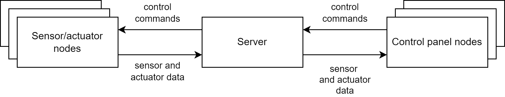

# Communication protocol

This document describes the protocol used for communication between the different nodes of the
distributed application.

## Terminology

* Sensor - a device which senses the environment and describes it with a value (an integer value in
  the context of this project). Examples: temperature sensor, humidity sensor.
* Actuator - a device which can influence the environment. Examples: a fan, a window opener/closer,
  door opener/closer, heater.
* Sensor and actuator node - a computer which has direct access to a set of sensors, a set of
  actuators and is connected to the Internet.
* Control-panel node - a device connected to the Internet which visualizes status of sensor and
  actuator nodes and sends control commands to them.
* Graphical User Interface (GUI) - A graphical interface where users of the system can interact with
  it.

## The underlying transport protocol

We use TCP as a transport protocol, port 1212 (on the server side). TCP was chosen, because the
server needs to have an overview of currently active sensor/actuator nodes as well as control-panel
nodes. Tracking of the control-panel nodes would require extra keep-alive messages, because
control-panel nodes may be silent for prolonged periods of time, without any issued commands. To
avoid unnecessary keep-alive messages or polling, TCP is used instead.

## The architecture

The network architecture is as follows (see figure below):

* A set of sensor/actuator nodes. Establish connection to the server. Send sensor-data and
  actuator-status messages to the server. Receive control commands from the server.
* One central server. Accepts incoming connections, forwards sensor and actuator status messages to
  all control nodes. Receives commands from control nodes, filters them and forwards to necessary
  sensor/actuator nodes.
* Control nodes. Establish connection to the server. Send control commands to the server. Receive
  sensor-data and actuator-status messages from the server.

## The flow of information and events

The following events happen in the system

### Sensor/actuator node

* On startup:
    * Establish connection to the server.
    * Send ["I'm a sensor node" message](#sensor-node-type-message) to the server.
* Periodically - every 5 seconds: Send a new [sensor-data message](#sensor-data-message)
  with current readings of all sensors to the server.
* When a command is received:
    * If the command is in incorrect format (for example, actuators of invalid type are referred
      to), send an [error message](#error-messages).
    * Update state of the necessary actuators.
    * Send an [actuator-state message](#actuator-state-message) to the server.

### The server

* On startup: start listening for incoming TCP connections.
* On a new connection: mark the connection with status "Unknown"
* When receiving a message from an unknown node:
    * When ["I'm a sensor node, ID=x" message](#sensor-node-type-message) is received:
        * Mark the node as "Ready", type=sensor
        * Save this message with actuator information for this sensor/actuator node
        * Forward the actuator information for this sensor/actuator node to all currently
          connected control panel nodes.
    * When ["I'm a control node" message](#control-node-type-message) is received:
        * Mark the node as "Ready", type=control
        * Send all the saved actuator information messages about all the currently connected
          sensor/actuator nodes to this control-panel node.
* On closed connection:
    * If the type of the node is sensor, send a ["sensor offline"
      notification message](#sensor-offline-notification-message)
      to all control-panel nodes.
    * It the type of the node is control panel, close the connection, do nothing else.
* On a message from a sensor/actuator node:
    * On [sensor data message](#sensor-data-message): forward the message to all control-panel
      nodes.
    * On [actuator status message](#actuator-state-message): forward the message to all
      control-panel nodes.
* On [actuator command](#actuator-command-message) from a control-panel node: forward the command to
  all matching sensor/actuator nodes (filter on the server).
* When other message is received (not described above):
  send ["Unknown message" error message](#error-messages) to the sender.

### Control-panel node

* On startup:
    * Establish connection to the server.
    * Send a ["I'm a control-panel node" message](#control-node-type-message) to the server.
* Receiving data:
    * ["I'm a control node" message](#control-node-type-message) - create a new node in the 
      logic (and GUI)
    * [Sensor data messages](#sensor-data-message) from the server:
        * If the sensor-data comes from an unknown sensor node, add the node to the known
          sensor/actuator node list
        * Update the GUI accordingly.
    * [Actuator state messages](#actuator-state-message) from the server, update the GUI
      accordingly.
    * [Sensor-offline notification](#sensor-offline-notification-message): remove the sensor node
      from the list (and GUI).
* On GUI event (user pressing actuator buttons): send the
  corresponding [actuator command](#actuator-command-message)
  to the server.

## Connection and state

The protocol is connection-oriented and stateful. The server keeps the following information about
each node:

* The type of it: unknown | sensor | actuator
* For sensor nodes: ID of the node and all the actuators it has

## Types, constants

* Sensor types: single-word strings. Examples: temperature, light, humidity. Maximum length: 20
  characters.
* ID of sensor nodes: a string-representation of an integer number, 1-5 characters long. Examples of
  valid IDs: 1, 2, 668, 12345. Leading zeroes must be ignored. For example, 12 and 00012 are
  considered as identical IDs.

## Message format

The general message formatting considerations:

* Message separators are used
* Messages are separated by a newline character \n (ASCII code 10)
* Fields in the message are separated by several different symbols, see description of specific
  message types below.

### Messages from sensor/actuator nodes

Sensor node can send the following messages:

* Sensor node type message
* Sensor data message
* Actuator state massage

#### Sensor node type message

This message is sent after the connection from a sensor/actuator node to the server is established
and the server/actuator node informs the server that it's type is "Sensor/actuator"
node. This is necessary so that the server add this node to the list of active sensor/actuator
nodes. Also, the sensor node describes all the actuators that it has available.

Message format: `type=sensor:<id>;<actuator_type_1>=<actuator_id_1>,...,
<actuator_type_N>=<actuator_id_N>`

Where:

* `<id>` is replaced with the ID of the sensor node.
* `N` actuators are reported, comma-separated. If the node has no actuators, the actuator
  section is skipped. Each actuator is represented by:
    * The type of the actuator, string. Examples: `fan`, `heater`.
    * Actuator ID, integer. Unique at the node level (i.e., no two actuators on the same node have
      the same ID) the node. Not guaranteed to be unique across the whole greenhouse network!.

Examples:

* A node with ID=1, no actuators: `type=sensor:1`
* A node with ID=13, two heaters (IDs 1 and 2) and one fan(ID=3):
  `type=sensor:13;heater=1,heater=2,fan=3`

#### Sensor data message

This message is sent periodically. The sensor node reports the current values (readings) for all the
sensors it has.

Message format: `sensors:<node_id>;<sensor_type_1>,<sensor_value_1>,<unit_1>;...
<sensor_type_N>,<sensor_value_N>,<unit_N>`

Where:

* `<node_id>` - ID of the sensor/actuator node, string representation of an integer.
* Multiple sensor readings can be reported, a four-value tuple for each sensor, separated by a
  semicolon. If there is only a single sensor, no semicolon is necessary.
* `<sensor_type_i` - the type of the `i-th` sensor, a string. Examples: `temperature`, `humidity`.
* `<sensor_value_i>` - the current value (reading) of the `i-th` sensor, a floating-point number
  with two decimal digits, represented as a string. Examples: `23.00`, `22.75`.
* `<unit_i>` - the unit for the `i-th` sensor, a string. Examples: `C`, `%`, `lux`. The units can be
  used to display human-friendly values in the GUI. Also, the units are important if some
  calculations on sensor data are performed.

Examples:

* A node with ID=12 reports 23C degrees on the only temperature sensor it
  has: `sensors:12;temperature,23.00,C`
* A node with ID=1 reports 23C degrees on the first temperature sensor, 22.5C on the other
  temperature sensor and 70.55%
  humidity: `sensors:1;temperature,23.00,C;temperature,22.50,C;humidity,0,70.55,%`

#### Actuator state message

This message is sent whenever a state of the actuator changes on a sensor/actuator node. The message
originates from a sensor/actuator node, it is sent to the server first. The server forwards it in
the same format to all control-panel nodes.

Each message contains information about a single actuator.

Message format: `actuator:<node_id>,<actuator_id,<actuator_state>`

Where:

* `<node_id>` - ID of the node, an integer, represented as a string. While this is, strictly
  speaking, not necessary when sent from a sensor/actuator node to the server (the server remembers
  the node ID), it is sent for convenience here. Therefore, the server can forward the message in
  exactly the same format to all control-panel nodes.
* `<actuator_id>` - ID of the actuator.
* `<actuator_state>` - one of two possible values: `on` or `off`. No other values are supported.

Examples:

* Fan with ID=1 on node with ID=5 is turned off: `actuator:5,fan,1,off`
* Window with ID=3 on node with ID=12 is opened: `actuator:12,window,3,on`

### Messages from control-panel nodes

Control-panel nodes send only two types of messages:

* Control node type message
* Actuator command message

#### Control node type message

This message is sent after a connection from a control-panel node to the server is established. The
control-panel node lets the server know that it is a control panel, not a sensor/actuator node.

Message format: `type=control`

The message is constant, no variations. No other information is included. Control panels don't have
any ID.

#### Actuator Command message

This message is sent by a control panel (to the server) whenever the control panel wants to change
state of one or several actuators on one or several sensor/actuator nodes.

Message format is very similar to [actuator state messages](#actuator-state-message). The only
difference: wildcards (`*`) are allowed to specify the value `any` for sensor/actuator node ID,
actuator type and/or actuator ID.

Message format: `actuator:<node_id_or_any>;<actuator_type_or_any>,<actuator_id_or_any>,
<actuator_state>`

Where:

* `<node_id_or_any>` - ID of the node, an integer, represented as a string. To send the message to
  all sensor/actuator nodes, use `*` here.
* `<actuator_type_or_any>` - type of the actuator, a string. To specify all the sensor types on the
  node, use `*`. Examples: `fan`, `window`, `*`.
* `<actuator_id_or_any>` - ID of the actuator or `*` to specify all actuators of given type.
  Examples: `1`, `2`, `*`.
* `<actuator_state>` - one of two possible values: `on` or `off`. No other values are supported.

Examples:

* Turn on fan with ID=2 on node with ID=12: `actuator:12;fan,2,on`
* Turn off all heaters on node with ID=3: `actuator:3;heater,*,off`
* Turn off the fan with ID=1 on all nodes: `actuator:*;fan,1,off`
* Turn on all heaters on all nodes: `actuator:*;heater,on`
* Turn off all actuators on all nodes: `actuator:*;*,*,off`

### Messages from the server

The server forwards the following received messages in their original format:

* [Sensor data message](#sensor-data-message) - to all control-panel nodes.
* [Actuator state message](#actuator-state-message) - to all control-panel nodes.
* [Actuator command message](#actuator-command-message) - to the necessary sensor/actuator nodes.

In addition, the server can send a [sensor-offline notification message]
(#sensor-offline-notification-message) to all control-panel nodes.

#### Sensor offline notification message

The server sends this message to all control-panel nodes to notify that a sensor node gone offline.

Message format: `offline:<node_id>`

Where:

* `<node_id>` - ID of the sensor/actuator node, an integer represented as a string.

Example: node with ID=12 has disconnected: `offline:12`

### Error messages

In case of an error, a node or the server can reply with an error message to the sender.

Message format: `error:<error_code>,<error_message>`

Where:

* `<error_code>` - one of the predefined error codes, see below
* `<error_message` - a human-readable explanation of the error

Allowed error codes:

* `E_unknown_message` - Unknown message type
* `E_invalid_value` - Used to specify that an invalid value is used inside the received message. For
  example, control panel asks to turn on an unknown actuator. The error message should explain more
  detail on what was wrong.

## An example scenario

The following is a typical scenario (which should be doable with the solution):

1. The server is started first, it starts listening for incoming connections.
2. A sensor node with ID=1 is started. It has a temperature sensor, two humidity sensors. It can
   also open a window. It establishes connection to the server and sends a
   message `type=sensor:1;window=1`.
3. The server saves this actuator-information (this message) in it's "registry".
4. A sensor node with ID=2 is started. It has a single temperature sensor and can control two fans
   and a heater. It establishes connection to the server and sends a
   message `type=sensor:2;fan=2,fan=3,heater=4`.
5. The server saves this actuator-information (this message) in it's "registry".
6. A control node connects to the server. It sends a message `type=control`.
7. The server sends the two actuator-information messages to the control-node:
    * `type=sensor:1;window=1`
    * `type=sensor:2;fan=2,fan=3,heater=4`
8. Upon receiving each of these messages, the first control node updates its knowledge about
   sensor/actuator nodes; and updates the GUI accordingly.
9. Another control node connects to the server. It sends a message `type=control`.
10. The server sends the two actuator-information messages to the second control-node:
    * `type=sensor:1;window=1`
    * `type=sensor:2;fan=2,fan=3,heater=4`
11. Upon receiving each of these messages, the second control node updates its knowledge about
    sensor/actuator nodes; and updates the GUI accordingly.
12. A sensor node with ID=3 is started. It has a two temperature sensors and no actuators. It
    establishes connection to the server and sends a message `type=sensor;3`.
13. The server saves this actuator-information (this message) in it's "registry".
14. The server sends the actuator-information of the node with ID=3 to both currently connected
    control-panel nodes: `type=sensor;3`.
15. Upon receiving each of these messages, both control-panel nodes update their knowledge about
    sensor/actuator nodes; and update the GUI accordingly.
16. After 5 seconds all three sensor/actuator nodes send a message to the server:
    * `sensors:1;temperature,23.00,C;temperature,22.50,C;humidity,70.55,%`
    * `sensors:2;temperature,75.00,F`
    * `sensors:3;temperature,22.22,C;temperature,23.23,C`
17. The server forwards all three sensor data messages to both control nodes.
18. Each control node now knows about all the sensor nodes, the sensors they have and the current
    readings of all the sensors.
19. The sensor sending and forwarding is repeated every 5 seconds.
20. The user of the first-control panel presses on the button "ON" for the first fan of
    sensor/actuator node with ID=2. Actuation command is sent to the server: `actuator:2;fan,2,on`.
21. The server sees that this message is meant only for sensor/actuator node with ID=2 and forwards
    the message to it.
22. The sensor/actuator node with ID=2 updates the state accordingly. Then it sends an actuator
    state message to the server: `actuator:2;fan,2,on`.
23. The server forwards this message to both control-panel nodes.
24. Each control-panel node updates the GUI accordingly.
25. The user of the second control-panel node presses on the button "turn off all actuators". An
    actuation command is sent to the server: `actuator:*;*,*,off`.
26. The server sees that this command is meant for all three sensor/actuator nodes and forwards it
    to all three of them.
27. Each sensor/actuator node updates the state accordingly, for each sensor. Then the nodes send
    the following messages to the server:
    * From node with ID=2:
        * `actuator:1;window,1,off`
    * From node with ID=2:
        * `actuator:2;fan,2,off`
        * `actuator:2;fan,3,off`
        * `actuator:2;heater,4,off`
28. The server forwards all four messages to both control-panel nodes.
29. The control-panel nodes update the GUI accordingly.

## Reliability mechanisms

The solution relies on the reliability mechanisms implemented in the TCP protocol - retransmissions,
error detection, detection of lost connectivity.

There no additional reliability mechanisms. If a node loses connection to the server, the
application is terminated. 